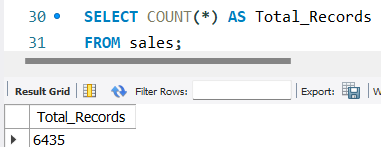
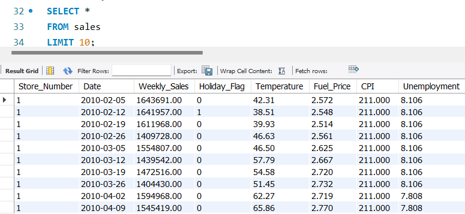
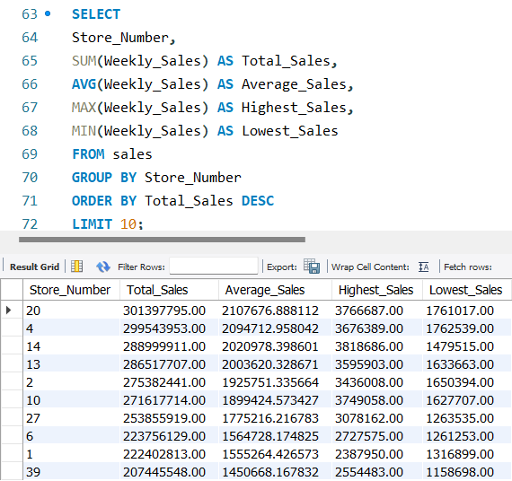
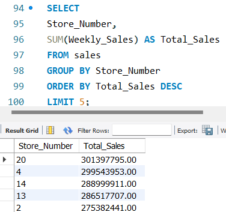
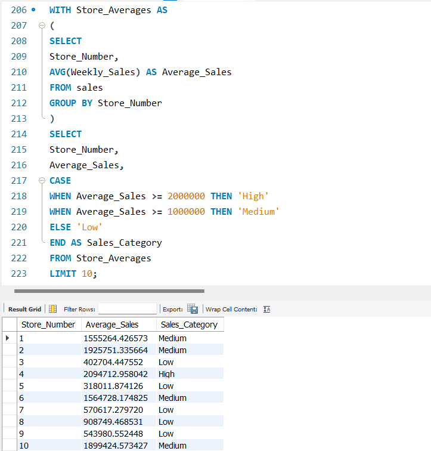
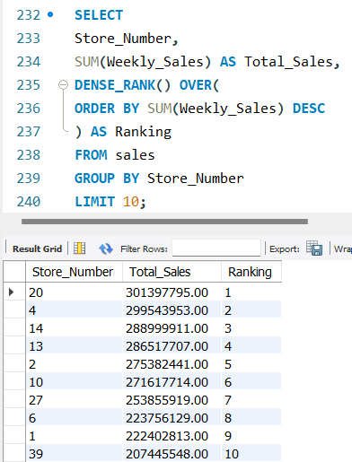

# SQL Walmart Sales Analysis
> A SQL portfolio project demonstrating data cleaning, exploratory data analysis (EDA), and advanced SQL techniques using MySQL.
---

## Project Overview

This project analyzes Walmart's weekly sales data using MySQL. The goal of this project is to answer real-world business questions while practicing SQL techniques commonly used by Data Analysts.

Topics covered include:

- SQL
- MySQL
- Data Cleaning
- Exploratory Data Analysis (EDA)
- Aggregate Functions
- GROUP BY
- ORDER BY
- HAVING
- CASE Statements
- Subqueries
- Common Table Expressions (CTEs)
- Window Functions

---

## Dataset

The dataset contains weekly sales information for Walmart stores, including sales, holiday status, temperature, fuel price, CPI, and unemployment.

---

## Project Structure

```
SQL-Walmart-Sales-Analysis/
│
├── data/
│   └── Walmart_sales_analysis.csv
│
├── sql/
│   ├── create_table.sql
│   ├── data_cleaning.sql
│   ├── exploratory_analysis.sql
│   └── advanced_queries.sql
│
├── screenshots/
│   ├── 01_total_records.png
│   ├── 02_dataset_preview.png
│   ├── 03_sales_summary_by_store.png
│   ├── 04_top_5_stores_by_total_sales.png
│   ├── 05_cte_example.png
│   └── 06_window_functions.png
│
└── README.md
```

---

# Database Setup

- Created the MySQL database
- Created the sales table
- Imported the CSV dataset using `LOAD DATA LOCAL INFILE`
- Converted date values using `STR_TO_DATE()`

---

# Data Cleaning

Performed several data quality checks:

- Checked total number of records
- Checked dataset preview
- Counted distinct stores
- Counted distinct weeks
- Checked date range
- Checked NULL values
- Checked negative sales
- Checked duplicate records

---

# Business Questions

The project answers several business questions, including:

1. Sales summary by store
2. Highest weekly sales
3. Holiday sales by store
4. Highest average non-holiday sales
5. Top 5 stores by total sales
6. Bottom 5 stores by average sales
7. Stores with average sales above $1M
8. Stores with total sales above $250M
9. Highest holiday average sales
10. Largest sales variation
11. Smallest sales variation
12. Holiday vs Non-Holiday comparison
13. Highest average temperature
14. Lowest average temperature
15. Average sales above 80°F
16. Average sales below 40°F

---

# Advanced SQL Concepts

This project also demonstrates:

- CASE WHEN
- Aggregate Functions
- Subqueries
- Common Table Expressions (CTEs)
- ROW_NUMBER()
- RANK()
- DENSE_RANK()

---

# Screenshots

## Total Records



---

## Dataset Preview



---

## Sales Summary



---

## Top 5 Stores



---

## CTE Example



---

## Window Function



---

# Skills Demonstrated

- SQL
- MySQL
- Data Cleaning
- Data Validation
- Exploratory Data Analysis
- Aggregate Functions
- CASE Statements
- GROUP BY
- ORDER BY
- HAVING
- Subqueries
- CTEs
- Window Functions

---

# Tools Used

- MySQL Workbench
- MySQL 8
- Git
- GitHub

---

# Future Improvements

- Build an interactive Power BI dashboard
- Add more business questions
- Optimize SQL queries